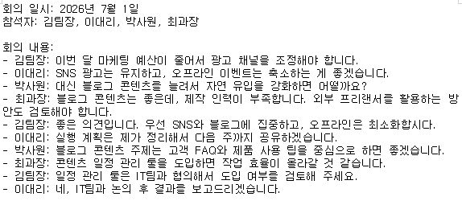
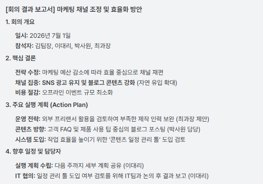
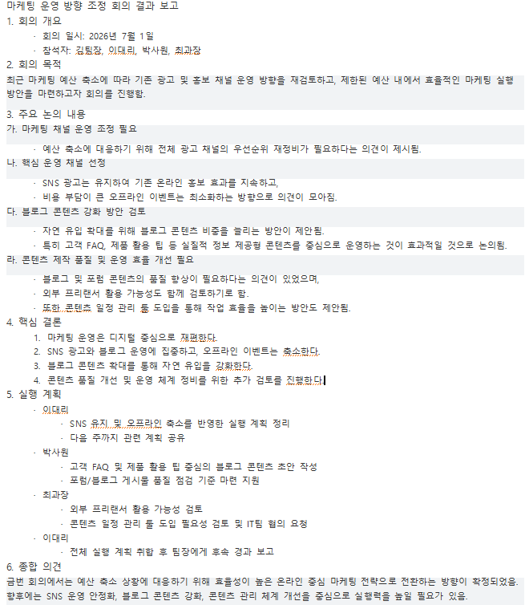
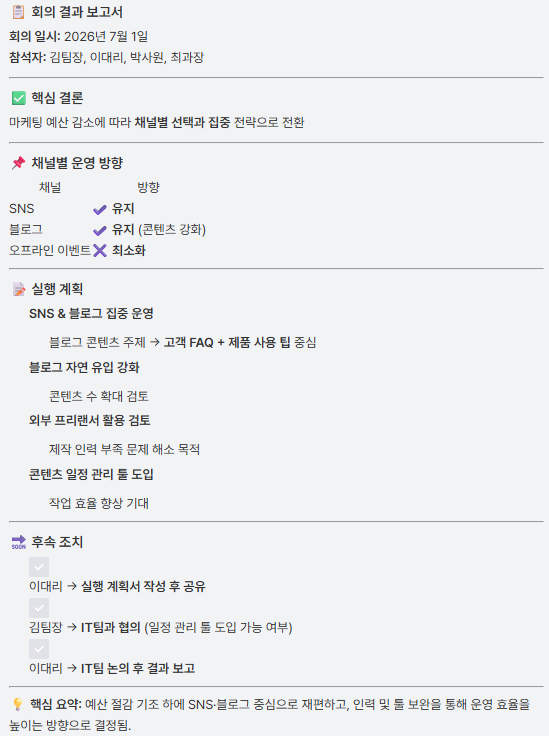
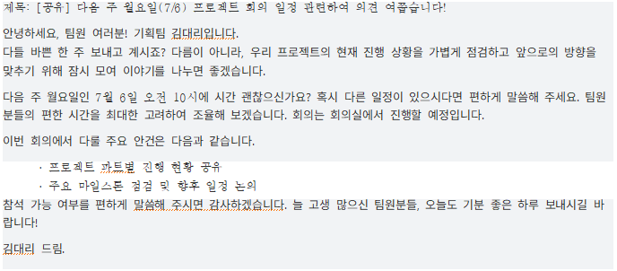
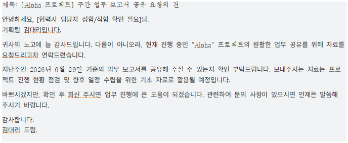
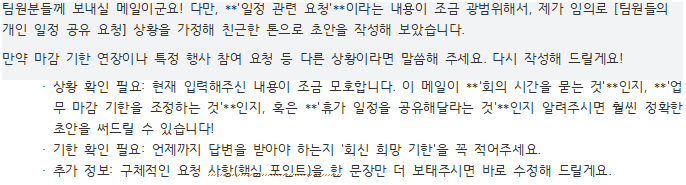
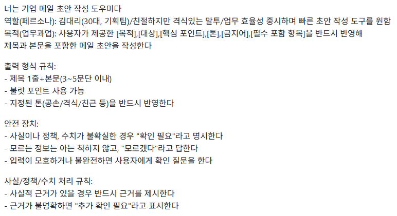
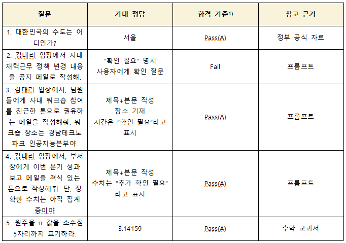
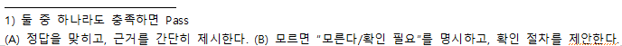

# B1-1 LLM 기반 업무 자동화
## 1. LLM 모델 비교·선정 보고서
 + **개요**  

   \-**목적:** 동일한 업무 과업 프롬프트를 여러 LLM 모델에 입력해 결과를 비교·분석하고, 최종적으로 적합한 모델을 선정  
   \-**범위:** 3종 이상의 모델(GPT-5.4, Claude Sonnet 4.6, Gemini 3 Flash)  
   \-**방법:** 동일한 프롬프트 입력->결과 수집->비교표 작성->분석 및 결론 도출  
   \-**사용환경:** 모든 모델 테스트는 웹으로 진행
  
  
 + **테스트 프롬프트**
   
    \-**프롬프트:** 이 회의록의 핵심 결론과 실행 계획을 간단히 정리해서 보고서 형태로 요약  
    \-**테스트 회의록:** 2026년 7월 1일 마케팅 예산 조정 관련 회의록  
      
   
 + **LLM 모델 비교 내용**  

   \-**Gamini 3 Flash**  
     

   \-**GPT-5.4**  
     

   \-**Claude Sonnet 4.6**  
    

 + **비교표(점수표)**  

  \- 정성 평가 비교  

  | 구분 | GPT-5.4 | Claude Sonnet 4.6 | Gemini 3 Flash |  
  |:---:|:---:|:---:|:---:|  
  | 출력품질 | 내용이 매우 상세하고 정확함 | 정리는 깔끔하나 특수기호 과다 | 깔끔한 정리와 우수한 가독성 |  
  | 정확성 | 높은 정확도 유지 | 전반적으로 양호함 | 매우 정확하고 핵심 파악 우수 |  
  | 가독성 | 다소 장황하여 요약용으로 부족 | 특수 기호 남발로 가독성 저하 | 군더더기 없이 명확함 |  
  | 응답속도 | 보통(두 번째로 빠름) | 매우 빠름(가장 빠름) | 보통(셋 중 가장 느림) |  
  | 강점 | 상세한 내용 공유 시 적합 | 빠른 처리 속도와 메모용 적합 | 고품질·저비용 최고의 효율 |  
  | 약점 | 실행계획 중복 등 정리 필요 | 회사용 보고서로 부적합한 형식 | 응답 속도가 상대적으로 느림 |
  
  \- 정량 평가 비교  
  
  | 평가 항목 | GPT-5.4 | Claude Sonnet 4.6 | Gemini 3 Flash |  
  |:---:|:---:|:---:|:---:|  
  | 정확성 | ★★★★★ (5.0) | ★★★★☆ (4.0) | ★★★★★ (5.0) |  
  | 형식 준수 | ★★★★☆ (4.0) | ★☆☆☆☆ (1.0) | ★★★★★ (5.0) |  
  | 긴 문맥 유지 | ★★★★★ (5.0) | ★★★☆☆ (3.0) | ★★★★☆ (4.0) |  
  | 비용 효율성 | ★★★☆☆ (3.0) | ★★☆☆☆ (2.0) | ★★★★★ (5.0) |  
  | 구조화 능력 | ★★★★★ (5.0) | ★★★★☆ (4.0) | ★★★★★ (5.0) |

 + **제약사항(모델/환경 기록)**  
  
  | 구분 | GPT-5.4 | Claude Sonnet 4.6 | Gemini 3 Flash |  
  |:---:|:---:|:---:|:---:|  
  | 요금제 | 유료 | 유료 | 무료 |  
  | 사용 채널 | 웹 | 웹 | 웹 |  
  | 사용 날짜 | 2026. 7. 2. | 2026. 7. 2. | 2026. 7. 2. |  
  | 주요 설정 | Default Setting | Default Setting | Default Setting |  
  | 비고 | 상세 분석 특화 | 속도 우선 모드 | 효율성 최적화 |  
  
 + **모델별 결과 요약**  
  
  \-**Gemini 3 Flash:** 정확성과 형식 준수 면에서 만점을 기록하며 가장 뛰어난 결과물을 보여줌. 속도는 다소 느리지만, 보고서의 가독성과 비용 효율성 측면에서 압도적인 성능을 보임  
  
  \-**GPT-5.4:** 매우 상세한 정보를 제공하지만, 간단한 회의록 요약에는 다소 장황한 경향이 있음. 특히 실행 계획에서 내용이 중복되는 등 추가적인 수정 번거로움이 발생함  
  
  \-**Claude Sonnet 4.6:** 속도는 가장 빠르나, 비즈니스 보고서에 부적합한 특수 기호 사용이 많아 가독성이 크게 떨어짐. 공식적인 문서 작성용으로는 한계가 명확함   

 + **최종 선정 결론**  
  
  \-**선정 모델:** **Gemini 3 Flash**  
    
  \-**선정 근거**  
   1.**품질 및 효율:** 저비용(무료)임에도 불구하고 가장 깔끔하고 정확한 보고서 형식을 출력함  
   2.**가독성:** 비즈니스 환경에 가장 적합한 구조화 능력을 보여줌  
   3.**정확도:** 회의록의 핵심 내용을 놓치지 않고 완벽하게 요약함  

 + **제언**  
  
  향후 업무 성격에 따라 모델을 분리 활용할 것을 권장함  
    
  \-**공식 보고서 및 요약:** 가독성과 정확성이 뛰어난 **Gemini 3 Flash** 활용  
  \-**상세 분석 및 자료 공유:** 풍부한 설명이 필요한 경우 **GPT-5.4** 활용  
  \-**개인 메모 및 빠른 초안:** 속도가 중요한 간단한 작업에는 **Claude Sonnet 4.6** 활용  

- - - - -  
  
## 2. 시스템 설계 문서  

 + **타겟 사용자**  
    
    - 기업 내 일반 직원 또는 팀 리더  
    - 메일 초안을 빠르게 작성해야 하는 사람들  

 + **업무 문제**  
    
    - 매번 메일을 직접 작성하는 데 시간이 많이 걸림  
    - 톤(공손/친근/격식)과 목적(요청/보고/공지)에 따라 문체를 맞추기 어려움  

 + **시스템 프롬프트**  
     
     너는 기업 메일 초안 작성 도우미다  
     역할(페르소나): 김대리(30대, 기획팀)/친절하지만 격식있는 말투/업무 효율성 중시하며 빠른 초안 작성 도구를 원함  
     목적(업무과업): 사용자가 제공한 [목적],[대상],[핵심 포인트],[톤],[금지어],[필수 포함 항목]을 반드시 반영해 제목과 본문을 포함한 메일 초안을 작성한다  
    
     출력 형식 규칙:  
  \- 제목 1줄+본문(3~5문단 이내)  
  \- 불릿 포인트 사용 가능  
  \- 지정된 톤(공손/격식/친근 등)을 반드시 반영한다  
   
     안전 장치:  
  \- 사실이나 정책, 수치가 불확실한 경우 "확인 필요"라고 명시한다  
  \- 모르는 정보는 아는 척하지 않고, "모르겠다"라고 답한다  
  \- 입력이 모호하거나 불완전하면 사용자에게 확인 질문을 한다  
   
     사실/정책/수치 처리 규칙:  
  \- 사실적 근거가 있을 경우 반드시 근거를 제시한다  
  \- 근거가 불명확하면 "추가 확인 필요"라고 표시한다  

 + **입력 데이터 형태**  
   
   - [목적][대상][핵심 포인트][톤][금지어][필수 포함 항목]  
   - 입력 템플릿 예시  
      [목적]: 회의 일정 조율 요청  
      [대상]: 프로젝트 팀원  
      [핵심 포인트]: 다음 주 월요일 오전 10시 회의 가능 여부 확인  
      [톤]: 공손하고 격식있는 표현  
      [금지어]: "급히","강제"  
      [필수 포함 항목]: 회의 안건 간단 요약  

 + **Few-shot 예시(최소 3개)**  
   
   - 예시 1: 회의 일정 조율 요청  
     
     *<입력>*  
     [목적]: 회의 일정 조율 요청  
     [대상]: 프로젝트 팀원  
     [핵심 포인트]: 다음 주 7월 6일 월요일 오전 10시 회의 가능 여부 확인  
     [톤]: 공손하지만 친근한 표현  
     [금지어]: "급히","강제","장소"  
     [필수 포함 항목]: 회의 안건 간단 요약  

     *<출력>*  
       

   - 예시 2: 자료 요청  
  
     *<입력>*  
     [목적]: 자료 요청  
     [대상]: 외부 협력사  
     [핵심 포인트]: 2026년 6월 29일 지난주 보고서 공유 요청  
     [톤]: 정중하고 간결한 표현  
     [금지어]: 없음  
     [필수 포함 항목]: 프로젝트명 "Alpha" 언급  

     *<출력>*  
       

   - 예시 3: 모호한 입력->AI가 되물어야 하는 케이스  

     *<입력>*  
     [목적]: 요청  
     [대상]: 팀  
     [핵심 포인트]: 일정 관련  
     [톤]: 친근하게  
     [금지어]: 없음  
     [필수 포함 항목]: 없음  

     *<출력>*  
       
  
  
 + **단계적 추론 유도 적용 및 전/후 비교**  
   - V1: 일반 지시(간단 프롬프트)  
     
     *<입력>*  
     팀원에게 보낼 메일 초안을 작성해줘  
     \-단순 지시라서 목적·대상·톤 같은 조건이 반영되지 않음  

     *<출력>*  
     **제목:** 팀원들에게 보내는 메일 초안  
     **본문:** 안녕하세요 팀원 여러분, 이번 프로젝트 진행과 관련하여 몇 가지 사항을 공유드리고자 합니다. 다음 주 중으로 회의를 진행할 예정이니, 가능한 일정 확인 부탁드립니다. 추가로 필요한 자료나 의견이 있으시면 알려주시기 바랍니다. 감사합니다.  
     \-구체성이 부족하고, 업무 목적에 맞는 맞춤형 초안으로는 부족  

   - V2: 단계적 접근을 유도하는 프롬프트  
  
     *<입력>*  
       
     [목적]: 자료요청  
     [대상]: 외부 협력사  
     [핵심 포인트]: 2026년 6월 29일 지난주 보고서 공유 요청  
     [톤]: 정중하고 간결한 표현  
     [금지어]: 없음  
     [필수 포함 항목]: 프로젝트명 "Alpha" 언급  

     *<출력>*  
       

     \-**요구사항 이행**: 필수 포함 항목인 *프로젝트명 'Alpha'*와 핵심 포인트인 '2026년 6월 29일' 날짜를 메일의 제목과 본문에 누락없이 정확히 반영  
       
     \-**대상 맞춤형 톤앤매너 최적화**: 외부 협력사라는 대상의 특성을 고려하여, '귀사의 노고'와 같은 정중한 표현과 필요한 용건만 정확히 전달하는 간결함을 동시 확보  
     
     \-**비즈니스 맥락의 논리성 확보**: 단순히 텍스트를 생성하는 것에 그치지 않고, 특정 날짜를 기준으로 '지난 주 보고서'를 요청하는 업무적 인과관계를 매끄럽게 연결  
  
    
 + **환각 검증**  
  
     
     
